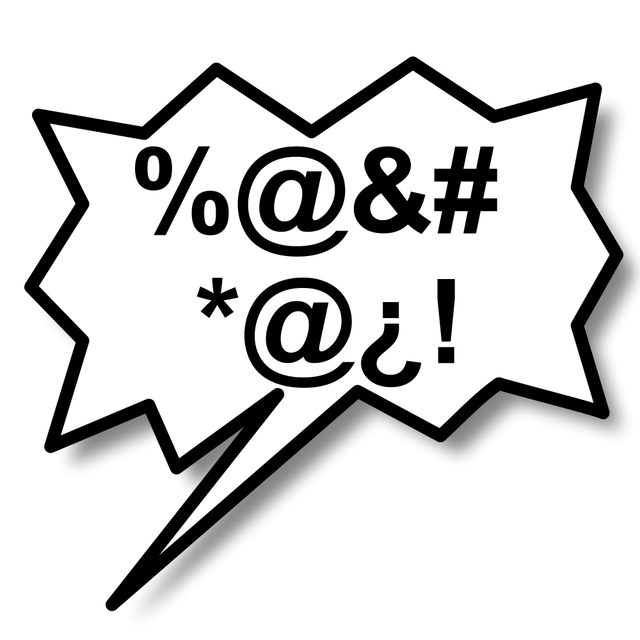

<p align="center">
<a href="https://github.com/firedragon9511/BWFilter"></a>
</p>


# BWFilter

With the BWFilter solution from firedragon9511 you can censor !@#$% users, it's the end of profanity in your games, chats or apps. It is the end of rude #$#@$%@ users. Now you can say "!@#$ you rude users". The anti-swear filter is very simple and flexible and doesn't have many files in the library like many other repositories do.

!@#$% !@#$% !@#$% !@#$% !@#$% !@#$% !@#$%

## Library content
```
/lib/bw_filter.js
```

## Importing BWFilter
```javascript 
// Your script are in same folder as the BWFilter.js:

const BWFilter = require("./BWFilter.js").BWFilter;

// Your script are inside folder that are inside your project root:

const BWFilter = require("./BWFilterFolder/BWFilter.js").BWFilter;
```

## Filtering using black list
```javascript 
String BWFilter.Filter(string); // Convert black listed words into grawlix

// Examples:

BWFilter.Filter("You are asshole"); // Output: You are @#$%%
BWFilter.Filter("You are a...s..s.ho..le"); // Output: You are @#$%%
BWFilter.Filter("You are a s s h o l e"); // Output: You are @#$%%
BWFilter.Filter("You are a55h0le"); // Output: You are @#$%%
BWFilter.Filter("You are asshol3"); // Output: You are @#$%%
BWFilter.Filter("You are a     s  s h  o    l     3"); // Output: You are @#$%%
BWFilter.Filter("You are b|tch"); // Output: You are @#$%%
BWFilter.Filter("You are b | t [ h"); // Output: You are @#$%%


```


## Detect has bad word
```javascript 
Object[] BWFilter.HasBadWord(string); // Return has a BadWord or no

// Example:

BWFilter.HasBadWord("Stop asshole"); // Output: [true,['asshole']]

BWFilter.HasBadWord("Stop a.s.s.h.o.le"); // Output: [true,['a.s.s.h.o.le']]

BWFilter.HasBadWord("Stop 4sshol3"); // Output: [true,['4sshol3']]

BWFilter.HasBadWord("Stop 4ssh0le fuck"); // Output: [true,['fuck','4ssh0le']]
```


## Filtering using white list
```javascript 
// This is recommended to kid applications, because you can allow only basic words for basic talking

String BWFilter.FilterWhiteList(string,array); // Convert non white listed words into grawlix

// Example:

BWFilter.FilterWhiteList("You are just a asshole.",["you", "are", "just", "a"]);

// Output: You are just a @#$$%$
```

## Detect letter emojis
```javascript
Object[] BWFilter.HasRegionalBadWord(string);

// Example:

BWFilter.HasRegionalBadWord("You are 🇧 🇮 🇹 🇨 🇭")); // Output: [true, ['b\x00i\x00t\x00c\x00h']]
```

## Setting black list words
```javascript 
void BWFilter.SetBlackList(array); // Set array

BWFilter.AddArrayToBlackList(array); // Append a array, ["c","d"] + ["a", "b"] = ["a","b","c","d"]
```


## Acessing results
```javascript
// You can access results:

    output = [true,['fuck','4ssh0le']];
    output[0]; // returns true
    output[1][0]; // returns 'fuck'

// Check position of bad word:

    myString.indexOf(output[1][0]);
      
// Check begin position and end position

    begin = myString.indexOf(output[1][0]);
    end = myString.indexOf(output[1][0]) + output[1][0].length;

```

## Detection tests
```
Detected:

    fffuccckkkkk 
    |=uck 
    f|_|ck 
    fuc|<
    81tch
    8|tch
    8!tch
    8..!..t..c..h
    f\nu\nc\nk\n

Not Detected:

    AAAAAAAfuckAAAAAAA

```


## Links

- [License][1]
- [Look library][2]

[1]: https://github.com/firedragon9511/BWFilter/blob/main/LICENSE.md
[2]: https://github.com/firedragon9511/BWFilter/blob/main/lib/bw_filter.js


## Like my project? 🍻
```

🍺 Donate me, BTC Address 🍺:

1G1TFRPQiZYsQsyZwy1Bmp7PVFtaH6nZhs

Thanks! 
```

!@#$% !@#$% !@#$% !@#$% !@#$% !@#$% !@#$%
